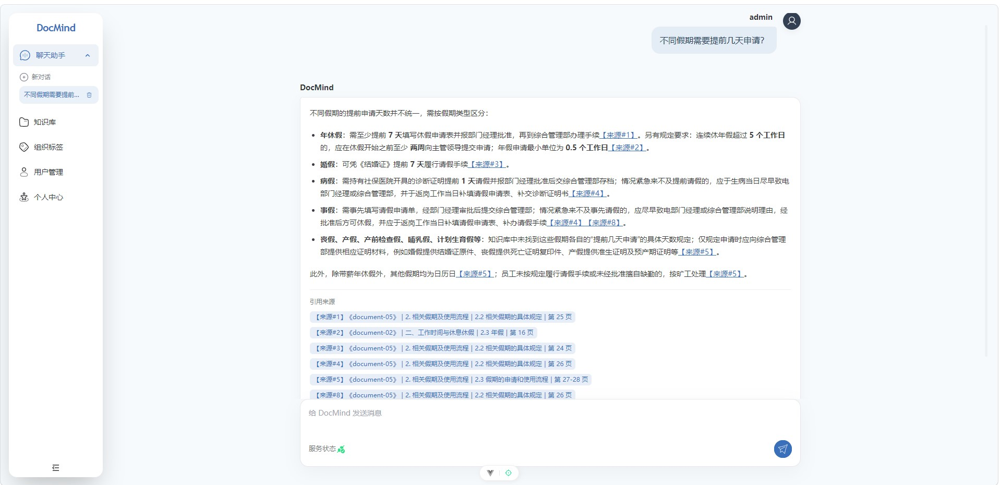
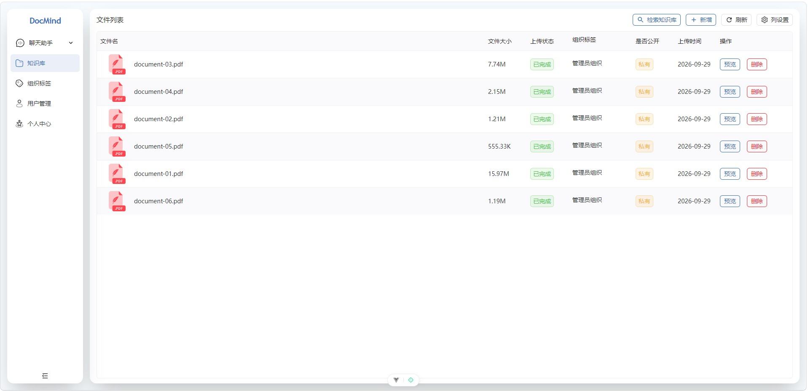
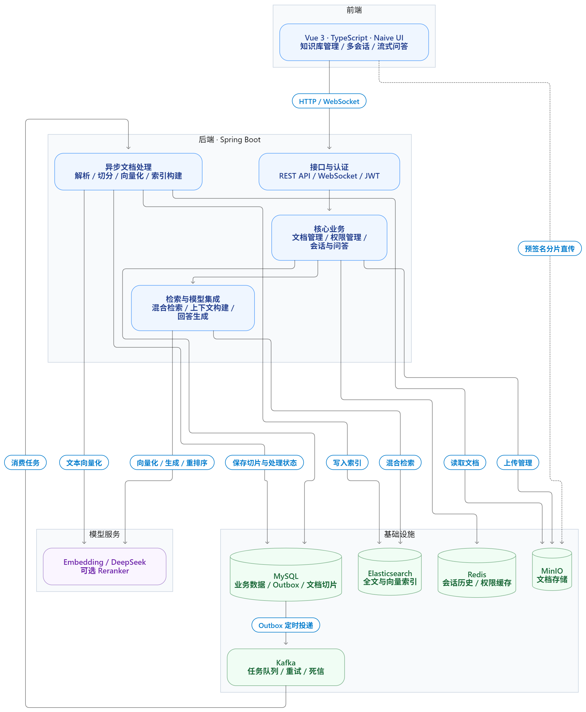

# DocMind - 智能知识库助手

针对文档资料分散、人工查阅耗时，以及关键词检索难以直接回答具体问题的需求，DocMind 实现了一个基于 RAG（检索增强生成）的智能知识库系统。项目围绕文档知识的统一管理与检索问答，整合了异步文档处理、混合检索和多轮对话能力，并通过来源引用与权限控制，使回答可追溯、资料访问有边界。

## 核心功能

- **大文件上传**：MinIO S3 Multipart Upload + 预签名 URL，浏览器直接上传分片，支持分片并发、进度展示和断点续传。
- **异步文档处理**：基于 MySQL 事务事件表（Outbox）与 Kafka，将文档上传与后台处理解耦，支持任务可靠投递、失败重试与处理恢复。
- **结构化解析与切分**：支持 PDF、DOCX、PPTX、Excel、CSV、Markdown、HTML 等格式，按文档结构提取与切分内容，保留章节标题、页码等来源信息，为检索与引用溯源提供基础。
- **混合检索**：Elasticsearch BM25 + 向量召回，使用加权 RRF 融合，可选 Reranker 重排序。
- **权限控制**：JWT 登录认证，结合文件归属、组织标签和公开属性过滤检索结果。
- **多轮问答**：根据近期对话改写追问，按近似 Token 预算选择历史消息，通过 WebSocket 流式返回回答，支持停止生成。
- **引用溯源**：回答附带本轮来源编号、文件名及来源定位；历史消息保存来源信息，刷新后可以恢复展示。
- **多会话管理**：创建、切换、删除会话；提供知识库、用户与组织管理界面。

## 界面展示







## 技术栈

| 层次         | 技术                                                      | 作用                                         |
| ------------ | --------------------------------------------------------- | -------------------------------------------- |
| 前端         | Vue 3、TypeScript、Vite、Naive UI、Pinia                  | 知识库管理、多会话及流式问答界面             |
| 后端         | Java、Spring Boot 3.4.2、Spring Security、Spring Data JPA | API、身份认证、业务逻辑与事务管理            |
| 数据库与缓存 | MySQL、Redis                                              | 文档元数据、任务记录、会话历史及组织权限缓存 |
| 对象存储     | MinIO                                                     | 原始文档存储、分片上传与预签名直传           |
| 消息队列     | Kafka                                                     | 文档处理任务的异步投递、失败重试与死信处理   |
| 检索引擎     | Elasticsearch、IK 分词                                    | 中文分词、全文检索与向量检索                 |
| 文档处理     | Apache Tika、PDFBox、Apache POI、Jsoup                    | 多格式文档解析、文本提取与来源定位           |
| 模型服务     | Embedding API、DeepSeek API、可选 Reranker API            | 文本向量化、回答生成与检索结果重排序         |


## 系统架构





## 快速开始

### 1. 准备环境

- JDK 21、Maven 3.9、Node.js ≥ 18.20、pnpm ≥ 8.7。
- MySQL 8、Redis、MinIO、Kafka、Elasticsearch 8.x，并安装与 ES 版本匹配的 IK 分词插件。
- 可用的 Embedding 与 DeepSeek API 凭据，Reranker 按需开启。

[Docker Compose](docs/docker-compose.yaml) 仅供环境搭建参考，需按实际部署调整端口、凭据与服务地址。

### 2. 初始化数据库

在 MySQL 客户端执行以下命令，将脚本路径替换为自己的项目路径：

```sql
CREATE DATABASE docmind CHARACTER SET utf8mb4 COLLATE utf8mb4_unicode_ci;
USE docmind;
SOURCE /path/to/DocMind/docs/databases/ddl.sql;
```

### 3. 配置连接与密钥

首次运行时，在项目根目录执行：

```powershell
Copy-Item .env.example .env
Copy-Item src/main/resources/application-example.yml src/main/resources/application.yml
```

编辑 `.env`，填写数据库、中间件连接信息、模型 API Key 和管理员密码。配置值不加引号；已有本地配置时无需重新复制。

- `MINIO_ENDPOINT` 为后端访问地址，`MINIO_PUBLIC_URL` 为浏览器可访问的 API 地址；提前创建 Bucket 并配置 CORS，见 [上传配置说明](docs/multipart-upload.md)。
- Kafka 地址及 `advertised.listeners` 应能被后端访问；中间件部署在虚拟机时，填写可访问的虚拟机 IP。
- `JWT_SECRET_KEY` 使用至少 32 字节随机密钥的 Base64 编码。
- 默认向量维度为 **2048**，Embedding 配置须与 [ES Mapping](src/main/resources/es-mappings/knowledge_base.json) 保持一致。

### 4. 创建 Kafka Topic

以下命令适用于名为 `kafka` 的 `apache/kafka` 容器，其他镜像需调整脚本路径：

```bash
docker exec kafka /opt/kafka/bin/kafka-topics.sh --bootstrap-server localhost:9092 --create --if-not-exists --topic file-processing --partitions 3 --replication-factor 1
docker exec kafka /opt/kafka/bin/kafka-topics.sh --bootstrap-server localhost:9092 --create --if-not-exists --topic file-processing-dlt --partitions 3 --replication-factor 1
```

DLT 分区数至少与业务 Topic 相同；上述命令不会调整已有 Topic 的分区数。单 Broker 部署需将事务状态内部 Topic 的副本数与最小 ISR 配置为 1。

### 5. 启动与访问

项目根目录启动后端：

```powershell
mvn spring-boot:run
```

另开终端启动前端：

```powershell
cd frontend
pnpm install
pnpm dev
```

访问 `http://localhost:9527`，后端默认端口为 `8081`。前端 API 与 WebSocket 地址在 [frontend/.env.test](frontend/.env.test) 中配置。

首次启动会创建管理员账号，用户名默认为 `admin`，密码为 `.env` 中设置的 `ADMIN_PASSWORD`。上传一份文本型 PDF，待处理完成后即可提问并查看引用来源。

## 项目结构

```text
DocMind/
├── frontend/                         # Vue 前端及 Workspace 包
├── src/main/java/com/yizhaoqi/docmind/
│   ├── config/                       # 安全、Kafka、ES 与初始化配置
│   ├── controller/                   # 上传、检索、会话和管理 API
│   ├── consumer/                     # 文件处理消费者
│   ├── client/                       # Embedding、LLM、Reranker 客户端
│   ├── service/                      # 文档处理、Outbox、检索与对话
│   ├── model/                        # 业务实体与任务模型
│   └── repository/                   # MySQL 数据访问
├── src/main/resources/
│   ├── application-example.yml       # 后端配置模板
│   └── es-mappings/                  # 检索索引定义
├── src/test/                         # 单元测试与检索集成评测代码
├── docs/databases/                   # 建表与迁移脚本
├── docs/jmeter/                      # 压测计划及使用说明
└── .env.example                      # 本地连接与凭据模板
```
